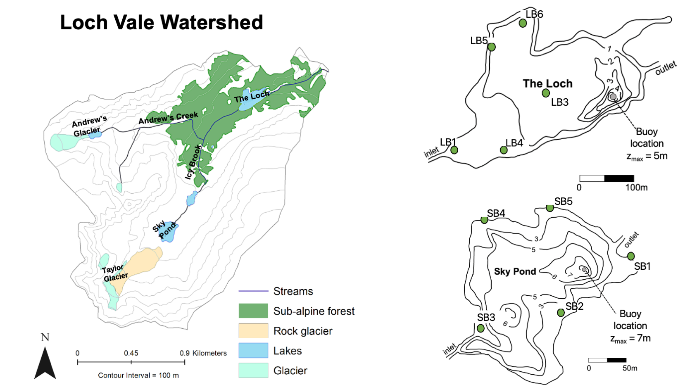

# FABs-DO-concept

## Welcome! :wave: 

## Instructions for use
* You can wrangle and view the temperature and D.O. data via 00_loadData.R in the `scripts` folder.
* All the data are in the `data` folder
* The site configurations for the littoral temperature loggers and buoys can be visualized below.

Loch Vale watershed is located in Rocky Mountain National Park and is the site of a <a href="https://www2.nrel.colostate.edu/projects/lvws/">long-term research program dating back to 1983.</a>

